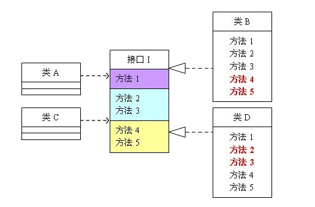
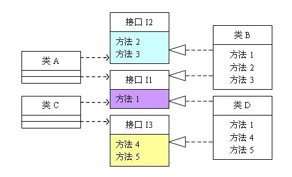
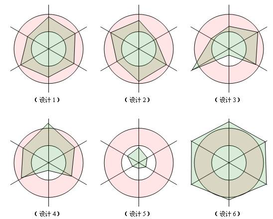

# 设计模式六大原则

## 设计模式六大原则（1）：单一职责原则  

**定义**：不要存在多于一个导致类变更的原因。通俗的说，即一个类只负责一项职责。

**问题由来**：类T负责两个不同的职责：职责P1，职责P2。当由于职责P1需求发生改变而需要修改类T时，有可能会导致原本运行正常的职责P2功能发生故障。

**解决方案**：遵循单一职责原则。分别建立两个类T1、T2，使T1完成职责P1功能，T2完成职责P2功能。这样，当修改类T1时，不会使职责P2发生故障风险；同理，当修改T2时，也不会使职责P1发生故障风险。

说到单一职责原则，很多人都会不屑一顾。因为它太简单了。稍有经验的程序员即使从来没有读过设计模式、从来没有听说过单一职责原则，在设计软件时也会自觉的遵守这一重要原则，因为这是常识。在软件编程中，谁也不希望因为修改了一个功能导致其他的功能发生故障。而避免出现这一问题的方法便是遵循单一职责原则。

虽然单一职责原则如此简单，并且被认为是常识，但是即便是经验丰富的程序员写出的程序，也会有违背这一原则的代码存在。为什么会出现这种现象呢？因为有职责扩散。所谓**职责扩散**，就是因为某种原因，职责P被分化为粒度更细的职责P1和P2。

比如：类T只负责一个职责P，这样设计是符合单一职责原则的。后来由于某种原因，也许是需求变更了，也许是程序的设计者境界提高了，需要将职责P细分为粒度更细的职责P1，P2，这时如果要使程序遵循单一职责原则，需要将类T也分解为两个类T1和T2，分别负责P1、P2两个职责。但是在程序已经写好的情况下，这样做简直太费时间了。所以，简单的修改类T，用它来负责两个职责是一个比较不错的选择，虽然这样做有悖于单一职责原则。（这样做的风险在于职责扩散的不确定性，因为我们不会想到这个职责P，在未来可能会扩散为P1，P2，P3，P4……Pn。所以记住，在职责扩散到我们无法控制的程度之前，立刻对代码进行重构。）

举例说明，用一个类描述动物呼吸这个场景：

```java
class Animal {
	public void breathe(String animal){
		System.out.println(animal+"呼吸空气");
	}
}
public class Client{
	public static void main(String[] args){
		Animal animal = new Animal();
		animal.breathe("牛");
		animal.breathe("羊");
		animal.breathe("猪");
	}
}
```

运行结果：

```
牛呼吸空气

羊呼吸空气

猪呼吸空气
```

程序上线后，发现问题了，并不是所有的动物都呼吸空气的，比如鱼就是呼吸水的。修改时如果遵循单一职责原则，需要将Animal类细分为陆生动物类Terrestrial，水生动物Aquatic，代码如下：

```java
class Terrestrial{
	public void breathe(String animal){
		System.out.println(animal+"呼吸空气");
	}
}
class Aquatic{
	public void breathe(String animal){
		System.out.println(animal+"呼吸水");
	}
}

public class Client{
	public static void main(String[] args){
		Terrestrial terrestrial = new Terrestrial();
		terrestrial.breathe("牛");
		terrestrial.breathe("羊");
		terrestrial.breathe("猪");
		
		Aquatic aquatic = new Aquatic();
		aquatic.breathe("鱼");
	}
}
```

运行结果：

```
牛呼吸空气

羊呼吸空气

猪呼吸空气

鱼呼吸水
```

我们会发现如果这样修改花销是很大的，除了将原来的类分解之外，还需要修改客户端。而直接修改类Animal来达成目的虽然违背了单一职责原则，但花销却小的多，代码如下：

```java
class Animal{
	public void breathe(String animal){
		if("鱼".equals(animal)){
			System.out.println(animal+"呼吸水");
		}else{
			System.out.println(animal+"呼吸空气");
		}
	}
}

public class Client{
	public static void main(String[] args){
		Animal animal = new Animal();
		animal.breathe("牛");
		animal.breathe("羊");
		animal.breathe("猪");
		animal.breathe("鱼");
	}
}
```

可以看到，这种修改方式要简单的多。但是却存在着隐患：有一天需要将鱼分为呼吸淡水的鱼和呼吸海水的鱼，则又需要修改Animal类的breathe方法，而对原有代码的修改会对调用“猪”“牛”“羊”等相关功能带来风险，也许某一天你会发现程序运行的结果变为“牛呼吸水”了。这种修改方式直接在代码级别上违背了单一职责原则，虽然修改起来最简单，但隐患却是最大的。还有一种修改方式：

```java
class Animal{
	public void breathe(String animal){
		System.out.println(animal+"呼吸空气");
	}

	public void breathe2(String animal){
		System.out.println(animal+"呼吸水");
	}
}

public class Client{
	public static void main(String[] args){
		Animal animal = new Animal();
		animal.breathe("牛");
		animal.breathe("羊");
		animal.breathe("猪");
		animal.breathe2("鱼");
	}
}
```

可以看到，这种修改方式没有改动原来的方法，而是在类中新加了一个方法，这样虽然也违背了单一职责原则，但在方法级别上却是符合单一职责原则的，因为它并没有动原来方法的代码。这三种方式各有优缺点，那么在实际编程中，采用哪一中呢？其实这真的比较难说，需要根据实际情况来确定。我的原则是：**只有逻辑足够简单，才可以在代码级别上违反单一职责原则；只有类中方法数量足够少，才可以在方法级别上违反单一职责原则**。

例如本文所举的这个例子，它太简单了，它只有一个方法，所以，无论是在代码级别上违反单一职责原则，还是在方法级别上违反，都不会造成太大的影响。实际应用中的类都要复杂的多，一旦发生职责扩散而需要修改类时，除非这个类本身非常简单，否则还是遵循单一职责原则的好。

遵循单一职责原的优点有：

* 可以降低类的复杂度，一个类只负责一项职责，其逻辑肯定要比负责多项职责简单的多；
* 提高类的可读性，提高系统的可维护性；
* 变更引起的风险降低，变更是必然的，如果单一职责原则遵守的好，当修改一个功能时，可以显著降低对其他功能的影响。

需要说明的一点是单一职责原则不只是面向对象编程思想所特有的，只要是模块化的程序设计，都适用单一职责原则。

## 设计模式六大原则（2）：里氏替换原则  

肯定有不少人跟我刚看到这项原则的时候一样，对这个原则的名字充满疑惑。其实原因就是这项原则最早是在1988年，由麻省理工学院的一位姓里的女士（Barbara Liskov）提出来的。

**定义1**：如果对每一个类型为 T1的对象 o1，都有类型为 T2 的对象o2，使得以 T1定义的所有程序 P 在所有的对象 o1 都代换成 o2 时，程序 P 的行为没有发生变化，那么类型 T2 是类型 T1 的子类型。

**定义2**：所有引用基类的地方必须能透明地使用其子类的对象。

**问题由来**：有一功能P1，由类A完成。现需要将功能P1进行扩展，扩展后的功能为P，其中P由原有功能P1与新功能P2组成。新功能P由类A的子类B来完成，则子类B在完成新功能P2的同时，有可能会导致原有功能P1发生故障。

**解决方案**：当使用继承时，遵循里氏替换原则。类B继承类A时，除添加新的方法完成新增功能P2外，尽量不要重写父类A的方法，也尽量不要重载父类A的方法。

继承包含这样一层含义：父类中凡是已经实现好的方法（相对于抽象方法而言），实际上是在设定一系列的规范和契约，虽然它不强制要求所有的子类必须遵从这些契约，但是如果子类对这些非抽象方法任意修改，就会对整个继承体系造成破坏。而里氏替换原则就是表达了这一层含义。

继承作为面向对象三大特性之一，在给程序设计带来巨大便利的同时，也带来了弊端。比如使用继承会给程序带来侵入性，程序的可移植性降低，增加了对象间的耦合性，如果一个类被其他的类所继承，则当这个类需要修改时，必须考虑到所有的子类，并且父类修改后，所有涉及到子类的功能都有可能会产生故障。

举例说明继承的风险，我们需要完成一个两数相减的功能，由类A来负责。

```java
class A{
	public int func1(int a, int b){
		return a-b;
	}
}

public class Client{
	public static void main(String[] args){
		A a = new A();
		System.out.println("100-50="+a.func1(100, 50));
		System.out.println("100-80="+a.func1(100, 80));
	}
}
```

运行结果：

```
100-50=50

100-80=20
```

后来，我们需要增加一个新的功能：完成两数相加，然后再与100求和，由类B来负责。即类B需要完成两个功能：

- 两数相减。
- 两数相加，然后再加100。

由于类A已经实现了第一个功能，所以类B继承类A后，只需要再完成第二个功能就可以了，代码如下：

```java
class B extends A{
	public int func1(int a, int b){
		return a+b;
	}
	
	public int func2(int a, int b){
		return func1(a,b)+100;
	}
}

public class Client{
	public static void main(String[] args){
		B b = new B();
		System.out.println("100-50="+b.func1(100, 50));
		System.out.println("100-80="+b.func1(100, 80));
		System.out.println("100+20+100="+b.func2(100, 20));
	}
}
```

类B完成后，运行结果：

```
100-50=150

100-80=180

100+20+100=220
```

我们发现原本运行正常的相减功能发生了错误。原因就是类B在给方法起名时无意中重写了父类的方法，造成所有运行相减功能的代码全部调用了类B重写后的方法，造成原本运行正常的功能出现了错误。在本例中，引用基类A完成的功能，换成子类B之后，发生了异常。在实际编程中，我们常常会通过重写父类的方法来完成新的功能，这样写起来虽然简单，但是整个继承体系的可复用性会比较差，特别是运用多态比较频繁时，程序运行出错的几率非常大。如果非要重写父类的方法，比较通用的做法是：原来的父类和子类都继承一个更通俗的基类，原有的继承关系去掉，采用依赖、聚合，组合等关系代替。

里氏替换原则通俗的来讲就是：子类可以扩展父类的功能，但不能改变父类原有的功能。它包含以下4层含义：

* 子类可以实现父类的抽象方法，但不能覆盖父类的非抽象方法。
* 子类中可以增加自己特有的方法。
* 当子类的方法重载父类的方法时，方法的前置条件（即方法的形参）要比父类方法的输入参数更宽松。
* 当子类的方法实现父类的抽象方法时，方法的后置条件（即方法的返回值）要比父类更严格。

看上去很不可思议，因为我们会发现在自己编程中常常会违反里氏替换原则，程序照样跑的好好的。所以大家都会产生这样的疑问，假如我非要不遵循里氏替换原则会有什么后果？

后果就是：你写的代码出问题的几率将会大大增加。

## 设计模式六大原则（3）：依赖倒置原则  

**定义**：高层模块不应该依赖低层模块，二者都应该依赖其抽象；抽象不应该依赖细节；细节应该依赖抽象。

**问题由来**：类A直接依赖类B，假如要将类A改为依赖类C，则必须通过修改类A的代码来达成。这种场景下，类A一般是高层模块，负责复杂的业务逻辑；类B和类C是低层模块，负责基本的原子操作；假如修改类A，会给程序带来不必要的风险。

**解决方案**：将类A修改为依赖接口I，类B和类C各自实现接口I，类A通过接口I间接与类B或者类C发生联系，则会大大降低修改类A的几率。

依赖倒置原则基于这样一个事实：相对于细节的多变性，抽象的东西要稳定的多。以抽象为基础搭建起来的架构比以细节为基础搭建起来的架构要稳定的多。在java中，抽象指的是接口或者抽象类，细节就是具体的实现类，使用接口或者抽象类的目的是制定好规范和契约，而不去涉及任何具体的操作，把展现细节的任务交给他们的实现类去完成。

依赖倒置原则的核心思想是面向接口编程，我们依旧用一个例子来说明面向接口编程比相对于面向实现编程好在什么地方。场景是这样的，母亲给孩子讲故事，只要给她一本书，她就可以照着书给孩子讲故事了。代码如下：

```java
class Book{
	public String getContent(){
		return "很久很久以前有一个阿拉伯的故事……";
	}
}

class Mother{
	public void narrate(Book book){
		System.out.println("妈妈开始讲故事");
		System.out.println(book.getContent());
	}
}

public class Client{
	public static void main(String[] args){
		Mother mother = new Mother();
		mother.narrate(new Book());
	}
}
```

运行结果：

```
妈妈开始讲故事

很久很久以前有一个阿拉伯的故事……
```

运行良好，假如有一天，需求变成这样：不是给书而是给一份报纸，让这位母亲讲一下报纸上的故事，报纸的代码如下：

```java
class Newspaper{
	public String getContent(){
		return "林书豪38+7领导尼克斯击败湖人……";
	}
}
```

这位母亲却办不到，因为她居然不会读报纸上的故事，这太荒唐了，只是将书换成报纸，居然必须要修改Mother才能读。假如以后需求换成杂志呢？换成网页呢？还要不断地修改Mother，这显然不是好的设计。原因就是Mother与Book之间的耦合性太高了，必须降低他们之间的耦合度才行。

我们引入一个抽象的接口IReader。读物，只要是带字的都属于读物：

```java
interface IReader{
	public String getContent();
}
```

Mother类与接口IReader发生依赖关系，而Book和Newspaper都属于读物的范畴，他们各自都去实现IReader接口，这样就符合依赖倒置原则了，代码修改为：

```java
class Newspaper implements IReader {
	public String getContent(){
		return "林书豪17+9助尼克斯击败老鹰……";
	}
}
class Book implements IReader{
	public String getContent(){
		return "很久很久以前有一个阿拉伯的故事……";
	}
}

class Mother{
	public void narrate(IReader reader){
		System.out.println("妈妈开始讲故事");
		System.out.println(reader.getContent());
	}
}

public class Client{
	public static void main(String[] args){
		Mother mother = new Mother();
		mother.narrate(new Book());
		mother.narrate(new Newspaper());
	}
}
```

运行结果：

```
妈妈开始讲故事

很久很久以前有一个阿拉伯的故事……

妈妈开始讲故事

林书豪17+9助尼克斯击败老鹰……
```

这样修改后，无论以后怎样扩展Client类，都不需要再修改Mother类了。这只是一个简单的例子，实际情况中，代表高层模块的Mother类将负责完成主要的业务逻辑，一旦需要对它进行修改，引入错误的风险极大。所以遵循依赖倒置原则可以降低类之间的耦合性，提高系统的稳定性，降低修改程序造成的风险。

采用依赖倒置原则给多人并行开发带来了极大的便利，比如上例中，原本Mother类与Book类直接耦合时，Mother类必须等Book类编码完成后才可以进行编码，因为Mother类依赖于Book类。修改后的程序则可以同时开工，互不影响，因为Mother与Book类一点关系也没有。参与协作开发的人越多、项目越庞大，采用依赖导致原则的意义就越重大。现在很流行的TDD开发模式就是依赖倒置原则最成功的应用。

传递依赖关系有三种方式，以上的例子中使用的方法是接口传递，另外还有两种传递方式：构造方法传递和setter方法传递，相信用过Spring框架的，对依赖的传递方式一定不会陌生。

在实际编程中，我们一般需要做到如下3点：

* 低层模块尽量都要有抽象类或接口，或者两者都有。
* 变量的声明类型尽量是抽象类或接口。
* 使用继承时遵循里氏替换原则。

依赖倒置原则的核心就是要我们面向接口编程，理解了面向接口编程，也就理解了依赖倒置。

## 设计模式六大原则（4）：接口隔离原则  

**定义**：客户端不应该依赖它不需要的接口；一个类对另一个类的依赖应该建立在最小的接口上。

**问题由来**：类A通过接口I依赖类B，类C通过接口I依赖类D，如果接口I对于类A和类B来说不是最小接口，则类B和类D必须去实现他们不需要的方法。

**解决方案**：将臃肿的接口I拆分为独立的几个接口，类A和类C分别与他们需要的接口建立依赖关系。也就是采用接口隔离原则。

举例来说明接口隔离原则：


（图1 未遵循接口隔离原则的设计）

这个图的意思是：类A依赖接口I中的方法1、方法2、方法3，类B是对类A依赖的实现。类C依赖接口I中的方法1、方法4、方法5，类D是对类C依赖的实现。对于类B和类D来说，虽然他们都存在着用不到的方法（也就是图中红色字体标记的方法），但由于实现了接口I，所以也必须要实现这些用不到的方法。对类图不熟悉的可以参照程序代码来理解，代码如下：

```java
interface I {
	public void method1();
	public void method2();
	public void method3();
	public void method4();
	public void method5();
}

class A{
	public void depend1(I i){
		i.method1();
	}
	public void depend2(I i){
		i.method2();
	}
	public void depend3(I i){
		i.method3();
	}
}

class B implements I{
	public void method1() {
		System.out.println("类B实现接口I的方法1");
	}
	public void method2() {
		System.out.println("类B实现接口I的方法2");
	}
	public void method3() {
		System.out.println("类B实现接口I的方法3");
	}
	//对于类B来说，method4和method5不是必需的，但是由于接口A中有这两个方法，
	//所以在实现过程中即使这两个方法的方法体为空，也要将这两个没有作用的方法进行实现。
	public void method4() {}
	public void method5() {}
}

class C{
	public void depend1(I i){
		i.method1();
	}
	public void depend2(I i){
		i.method4();
	}
	public void depend3(I i){
		i.method5();
	}
}

class D implements I{
	public void method1() {
		System.out.println("类D实现接口I的方法1");
	}
	//对于类D来说，method2和method3不是必需的，但是由于接口A中有这两个方法，
	//所以在实现过程中即使这两个方法的方法体为空，也要将这两个没有作用的方法进行实现。
	public void method2() {}
	public void method3() {}

	public void method4() {
		System.out.println("类D实现接口I的方法4");
	}
	public void method5() {
		System.out.println("类D实现接口I的方法5");
	}
}

public class Client{
	public static void main(String[] args){
		A a = new A();
		a.depend1(new B());
		a.depend2(new B());
		a.depend3(new B());
		
		C c = new C();
		c.depend1(new D());
		c.depend2(new D());
		c.depend3(new D());
	}
}
```

可以看到，如果接口过于臃肿，只要接口中出现的方法，不管对依赖于它的类有没有用处，实现类中都必须去实现这些方法，这显然不是好的设计。如果将这个设计修改为符合接口隔离原则，就必须对接口I进行拆分。在这里我们将原有的接口I拆分为三个接口，拆分后的设计如图2所示：


（图2 遵循接口隔离原则的设计）

照例贴出程序的代码，供不熟悉类图的朋友参考：

```java
interface I1 {
	public void method1();
}

interface I2 {
	public void method2();
	public void method3();
}

interface I3 {
	public void method4();
	public void method5();
}

class A{
	public void depend1(I1 i){
		i.method1();
	}
	public void depend2(I2 i){
		i.method2();
	}
	public void depend3(I2 i){
		i.method3();
	}
}

class B implements I1, I2{
	public void method1() {
		System.out.println("类B实现接口I1的方法1");
	}
	public void method2() {
		System.out.println("类B实现接口I2的方法2");
	}
	public void method3() {
		System.out.println("类B实现接口I2的方法3");
	}
}

class C{
	public void depend1(I1 i){
		i.method1();
	}
	public void depend2(I3 i){
		i.method4();
	}
	public void depend3(I3 i){
		i.method5();
	}
}

class D implements I1, I3{
	public void method1() {
		System.out.println("类D实现接口I1的方法1");
	}
	public void method4() {
		System.out.println("类D实现接口I3的方法4");
	}
	public void method5() {
		System.out.println("类D实现接口I3的方法5");
	}
}
```

**接口隔离原则的含义是**：建立单一接口，不要建立庞大臃肿的接口，尽量细化接口，接口中的方法尽量少。也就是说，我们要为各个类建立专用的接口，而不要试图去建立一个很庞大的接口供所有依赖它的类去调用。本文例子中，将一个庞大的接口变更为3个专用的接口所采用的就是接口隔离原则。在程序设计中，依赖几个专用的接口要比依赖一个综合的接口更灵活。接口是设计时对外部设定的“契约”，通过分散定义多个接口，可以预防外来变更的扩散，提高系统的灵活性和可维护性。

说到这里，很多人会觉的接口隔离原则跟之前的单一职责原则很相似，其实不然。其一，单一职责原则原注重的是职责；而接口隔离原则注重对接口依赖的隔离。其二，单一职责原则主要是约束类，其次才是接口和方法，它针对的是程序中的实现和细节；而接口隔离原则主要约束接口接口，主要针对抽象，针对程序整体框架的构建。

采用接口隔离原则对接口进行约束时，要注意以下几点：

* 接口尽量小，但是要有限度。对接口进行细化可以提高程序设计灵活性是不挣的事实，但是如果过小，则会造成接口数量过多，使设计复杂化。所以一定要适度。
* 为依赖接口的类定制服务，只暴露给调用的类它需要的方法，它不需要的方法则隐藏起来。只有专注地为一个模块提供定制服务，才能建立最小的依赖关系。
* 提高内聚，减少对外交互。使接口用最少的方法去完成最多的事情。

运用接口隔离原则，一定要适度，接口设计的过大或过小都不好。设计接口的时候，只有多花些时间去思考和筹划，才能准确地实践这一原则。

## 设计模式六大原则（5）：迪米特法则  

**定义**：一个对象应该对其他对象保持最少的了解。

**问题由来**：类与类之间的关系越密切，耦合度越大，当一个类发生改变时，对另一个类的影响也越大。

**解决方案**：尽量降低类与类之间的耦合。

自从我们接触编程开始，就知道了软件编程的总的原则：低耦合，高内聚。无论是面向过程编程还是面向对象编程，只有使各个模块之间的耦合尽量的低，才能提高代码的复用率。低耦合的优点不言而喻，但是怎么样编程才能做到低耦合呢？那正是迪米特法则要去完成的。

**迪米特法则又叫最少知道原则**，最早是在1987年由美国Northeastern University的Ian Holland提出。通俗的来讲，就是一个类对自己依赖的类知道的越少越好。也就是说，对于被依赖的类来说，无论逻辑多么复杂，都尽量地的将逻辑封装在类的内部，对外除了提供的public方法，不对外泄漏任何信息。迪米特法则还有一个更简单的定义：只与直接的朋友通信。首先来解释一下什么是直接的朋友：每个对象都会与其他对象有耦合关系，只要两个对象之间有耦合关系，我们就说这两个对象之间是朋友关系。耦合的方式很多，依赖、关联、组合、聚合等。其中，我们称出现成员变量、方法参数、方法返回值中的类为直接的朋友，而出现在局部变量中的类则不是直接的朋友。也就是说，陌生的类最好不要作为局部变量的形式出现在类的内部。

举一个例子：有一个集团公司，下属单位有分公司和直属部门，现在要求打印出所有下属单位的员工ID。先来看一下违反迪米特法则的设计。

```java
//总公司员工
class Employee{
	private String id;
	public void setId(String id){
		this.id = id;
	}
	public String getId(){
		return id;
	}
}

//分公司员工
class SubEmployee{
	private String id;
	public void setId(String id){
		this.id = id;
	}
	public String getId(){
		return id;
	}
}

class SubCompanyManager{
	public List<SubEmployee> getAllEmployee(){
		List<SubEmployee> list = new ArrayList<SubEmployee>();
		for(int i=0; i<100; i++){
			SubEmployee emp = new SubEmployee();
			//为分公司人员按顺序分配一个ID
			emp.setId("分公司"+i);
			list.add(emp);
		}
		return list;
	}
}

class CompanyManager{

	public List<Employee> getAllEmployee(){
		List<Employee> list = new ArrayList<Employee>();
		for(int i=0; i<30; i++){
			Employee emp = new Employee();
			//为总公司人员按顺序分配一个ID
			emp.setId("总公司"+i);
			list.add(emp);
		}
		return list;
	}
	
	public void printAllEmployee(SubCompanyManager sub){
		List<SubEmployee> list1 = sub.getAllEmployee();
		for(SubEmployee e:list1){
			System.out.println(e.getId());
		}

		List<Employee> list2 = this.getAllEmployee();
		for(Employee e:list2){
			System.out.println(e.getId());
		}
	}
}

public class Client{
	public static void main(String[] args){
		CompanyManager e = new CompanyManager();
		e.printAllEmployee(new SubCompanyManager());
	}
}
```

现在这个设计的主要问题出在CompanyManager中，根据迪米特法则，只与直接的朋友发生通信，而SubEmployee类并不是CompanyManager类的直接朋友（以局部变量出现的耦合不属于直接朋友），从逻辑上讲总公司只与他的分公司耦合就行了，与分公司的员工并没有任何联系，这样设计显然是增加了不必要的耦合。按照迪米特法则，应该避免类中出现这样非直接朋友关系的耦合。修改后的代码如下:

```java
class SubCompanyManager{
	public List<SubEmployee> getAllEmployee(){
		List<SubEmployee> list = new ArrayList<SubEmployee>();
		for(int i=0; i<100; i++){
			SubEmployee emp = new SubEmployee();
			//为分公司人员按顺序分配一个ID
			emp.setId("分公司"+i);
			list.add(emp);
		}
		return list;
	}
	public void printEmployee(){
		List<SubEmployee> list = this.getAllEmployee();
		for(SubEmployee e:list){
			System.out.println(e.getId());
		}
	}
}

class CompanyManager{
	public List<Employee> getAllEmployee(){
		List<Employee> list = new ArrayList<Employee>();
		for(int i=0; i<30; i++){
			Employee emp = new Employee();
			//为总公司人员按顺序分配一个ID
			emp.setId("总公司"+i);
			list.add(emp);
		}
		return list;
	}
	
	public void printAllEmployee(SubCompanyManager sub){
		sub.printEmployee();
		List<Employee> list2 = this.getAllEmployee();
		for(Employee e:list2){
			System.out.println(e.getId());
		}
	}
}
```

修改后，为分公司增加了打印人员ID的方法，总公司直接调用来打印，从而避免了与分公司的员工发生耦合。

迪米特法则的初衷是降低类之间的耦合，由于每个类都减少了不必要的依赖，因此的确可以降低耦合关系。但是凡事都有度，虽然可以避免与非直接的类通信，但是要通信，必然会通过一个“中介”来发生联系，例如本例中，总公司就是通过分公司这个“中介”来与分公司的员工发生联系的。过分的使用迪米特原则，会产生大量这样的中介和传递类，导致系统复杂度变大。所以在采用迪米特法则时要反复权衡，既做到结构清晰，又要高内聚低耦合。

## 设计模式六大原则（6）：开闭原则 

**定义**：一个软件实体如类、模块和函数应该对扩展开放，对修改关闭。

**问题由来**：在软件的生命周期内，因为变化、升级和维护等原因需要对软件原有代码进行修改时，可能会给旧代码中引入错误，也可能会使我们不得不对整个功能进行重构，并且需要原有代码经过重新测试。

**解决方案**：当软件需要变化时，尽量通过扩展软件实体的行为来实现变化，而不是通过修改已有的代码来实现变化。

开闭原则是面向对象设计中最基础的设计原则，它指导我们如何建立稳定灵活的系统。开闭原则可能是设计模式六项原则中定义最模糊的一个了，它只告诉我们对扩展开放，对修改关闭，可是到底如何才能做到对扩展开放，对修改关闭，并没有明确的告诉我们。以前，如果有人告诉我“你进行设计的时候一定要遵守开闭原则”，我会觉的他什么都没说，但貌似又什么都说了。因为开闭原则真的太虚了。

在仔细思考以及仔细阅读很多设计模式的文章后，终于对开闭原则有了一点认识。其实，我们遵循设计模式前面5大原则，以及使用23种设计模式的目的就是遵循开闭原则。也就是说，只要我们对前面5项原则遵守的好了，设计出的软件自然是符合开闭原则的，这个开闭原则更像是前面五项原则遵守程度的“平均得分”，前面5项原则遵守的好，平均分自然就高，说明软件设计开闭原则遵守的好；如果前面5项原则遵守的不好，则说明开闭原则遵守的不好。

其实笔者认为，开闭原则无非就是想表达这样一层意思：用抽象构建框架，用实现扩展细节。因为抽象灵活性好，适应性广，只要抽象的合理，可以基本保持软件架构的稳定。而软件中易变的细节，我们用从抽象派生的实现类来进行扩展，当软件需要发生变化时，我们只需要根据需求重新派生一个实现类来扩展就可以了。当然前提是我们的抽象要合理，要对需求的变更有前瞻性和预见性才行。

说到这里，再回想一下前面说的5项原则，恰恰是告诉我们用抽象构建框架，用实现扩展细节的注意事项而已：单一职责原则告诉我们实现类要职责单一；里氏替换原则告诉我们不要破坏继承体系；依赖倒置原则告诉我们要面向接口编程；接口隔离原则告诉我们在设计接口的时候要精简单一；迪米特法则告诉我们要降低耦合。而开闭原则是总纲，他告诉我们要对扩展开放，对修改关闭。

最后说明一下如何去遵守这六个原则。对这六个原则的遵守并不是是和否的问题，而是多和少的问题，也就是说，我们一般不会说有没有遵守，而是说遵守程度的多少。任何事都是过犹不及，设计模式的六个设计原则也是一样，制定这六个原则的目的并不是要我们刻板的遵守他们，而需要根据实际情况灵活运用。对他们的遵守程度只要在一个合理的范围内，就算是良好的设计。我们用一幅图来说明一下。


图中的每一条维度各代表一项原则，我们依据对这项原则的遵守程度在维度上画一个点，则如果对这项原则遵守的合理的话，这个点应该落在红色的同心圆内部；如果遵守的差，点将会在小圆内部；如果过度遵守，点将会落在大圆外部。一个良好的设计体现在图中，应该是六个顶点都在同心圆中的六边形。



在上图中，设计1、设计2属于良好的设计，他们对六项原则的遵守程度都在合理的范围内；设计3、设计4设计虽然有些不足，但也基本可以接受；设计5则严重不足，对各项原则都没有很好的遵守；而设计6则遵守过渡了，设计5和设计6都是迫切需要重构的设计。

到这里，设计模式的六大原则就写完了。主要参考书籍有《设计模式》《设计模式之禅》《大话设计模式》以及网上一些零散的文章，但主要内容主要还是我本人对这六个原则的感悟。写出来的目的一方面是对这六项原则系统地整理一下，一方面也与广大的网友分享，因为设计模式对编程人员来说，的确非常重要。正如有句话叫做一千个读者眼中有一千个哈姆雷特，如果大家对这六项原则的理解跟我有所不同，欢迎留言，大家共同探讨。

[设计模式六大原则](http://www.uml.org.cn/sjms/201211023.asp)
