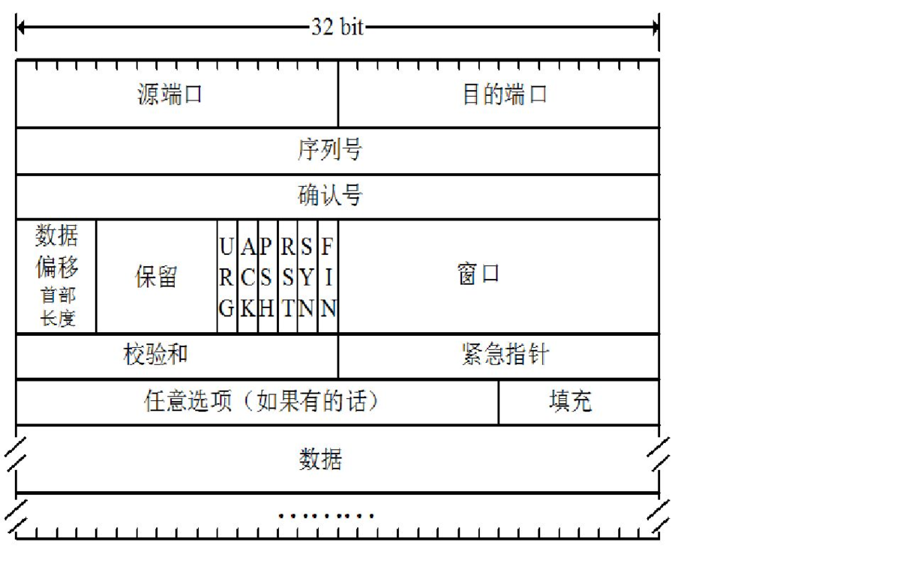
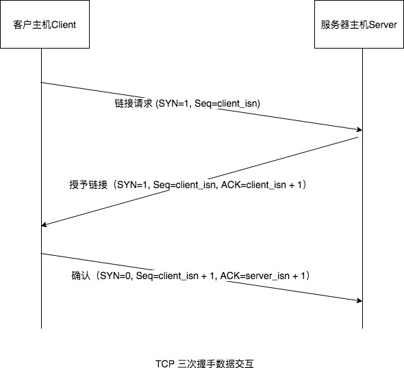
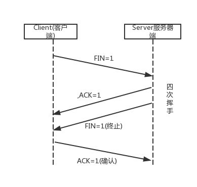

# 网络相关之TCP、三次握手、四次挥手、代码实现

## 一、TCP的特点

面向连接、可靠传输、面向字节流、全双工服务

## 二、报文结构

TCP报文段由 **首部字段** 和一个 **数据字段** 组成。
数据字段包含一块应用数据。最大报文长度 `MSS` （Maximum Segment Size）限制了报文段数据字段的最大长度。 `MSS` 选项用于在TCP连接建立时，收发双方协商通信时每一个报文段所能承载的最大数据长度。
所以当TCP发送一个大文件（比如一张高清图片）时，通常是将该文件划分为 `MSS` 长度的若干块（最后一块除外，通常会小于 `MSS` ）。而实际交互式应用通常传送长度小于 `MSS` 的数据块。



如图，与UDP一样，首部包括 ***源端口号*** 和 ***目的端口号*** ，用于多路复用/分解来自上层或送到上层应用的数据。TCP首部也同样包括 ***检验和字段***
TCP首部还包含下列字段:

* 32比特的 ***序号字段Seq(sequence number field)*** 和32比特的 ***确认号字段Ack(acknowledge number field)***
* 16比特的 ***接收窗口字段RW(receive window field)***,该字段用于流量控制，用于指示接收方愿意接收的字节数量。
* 4比特的 ***首部长度字段（header length field）*** ，该字段指示了以32比特的字为单位的TCP首部长度。由于TCP选项字段的原因，TCP首部长度是可变的。（通常，选项字段为空，所以TCP首部的典型长度就是20字节）
* 可选和变长的 ***选项字段（option field）*** ，该字段用于发送方和接收方协商最大报文段长度（MSS）时，或用作窗口调节因子时使用。
* 6比特的 ***标志字段（flag field）*** 。 ***ACK*** 比特用于指示确认字段中的值是有效的，即该报文段包括一个对已被接收报文段的确认。 ***RST***、***SYN***、***FIN*** 比特用于连接建立和拆除。
* ***PSH*** 比特指示接收方应立即将数据交给上层。 ***URG*** 比特用于指示报文段里存在着被发送端的上层实体置为“紧急”的数据。紧急数据的最后一个字节由16比特的紧急数据指针字段指出。当紧急数据存在并给出指向紧急数据尾的指针的时候，TCP必须通知接收端的上层实体。在实践中，PSH、URG和紧急数据指针并没有使用。

###### 3、序号字段Seq和确认号字段Ack

* 在TCP通讯中，无论是建立连接，数据传输，友好断开，强制断开，都离不开Seq值和Ack值，它们是TCP传输的可靠保证。

***序号Seq*** ：
TCP把数据看成一个无结构的、有序的字节流。一个 ***报文段的序号*** 因此是该报文段的首字节的字节流编号。
比如数据流由一个包含 `100000` 字节的文件组成，其 `MSS` 是 `1000` 字节，数据流的首字节编号是0。该TCP将为该数据流构建 `100` 个报文段。给第一个报文段分配序号0，第二个则是 `1000` ，第三个是 `2000` ，以此类推。每一个序号被填入到相应TCP报文段首部的序号字段中。
***确认号Ack*** ： TCP是全双工服务的，因此主机A在向主机B发送数据的同时，也许也在接收主机B的数据。

主机A填充进报文段的确认号是主机A期望从主机B收到的下一个字节的序号。

在上个例子中，假如服务端已经接收包含字节 `0-999` 的报文段和包含字节 `2000-2999` 的报文段，但由于某种原因，还未收到包含字节 `1000-1999` 的报文段，那么将仍会等待字节 `1000` （及其后的字节）。因此服务端发给客户端的下一个报文段将在 ***确认号Ack*** 字段中包含 `1000` 。
因为TCP只确认该流中至第一个丢失字节为止的字节，所以TCP被称为 ***累积确认*** 。

#### 三、三次握手

数据开始传输前，需要通过 `三次握手` 来建立连接
事实上我认为，这里称呼 `三步握手` （three-way handshake）才更贴切些



网上找的图片有点问题，第二步的序号应为server_isn

***第一步*** ：

* 客户端的TCP首先向服务端的TCP发送一条特殊的TCP报文段。该报文段不包含应用层数据，该报文段首部中的一个 `标志位（SYN比特）` 被置为1，所以该报文段被称为 ***SYN报文段*** 。另外，客户会随机选择一个初始序号 `client_isn` ，并将该序号放置于该起始的TCP `Seq` 报文段的序号字段中。
* 客户端和服务端最开始都处于 `CLOSED` 状态，发送过该 `SYN` 报文段后，客户端TCP进入 `SYN_SENT` 状态，等待服务端确认并将SYN比特置为1的报文段。

***第二步*** ：

* 收到SYN报文段后，服务端会为该TCP连接分配TCP缓存和变量，服务端TCP会进入 `SYN_RCVD` 状态，等待客户端TCP发送确认报文段。
* 并向该客户端TCP发送允许连接的报文段，该报文段同样不包含应用层数据。该报文段首部的 `SYN` 比特被置为1，确认号字段被置为 `client_isn` +1。服务端还会选择自己的初始序号 `server_isn` ，放到报文段首部的序号段中。该连接被称为 ***SYNACK报文段*** 。

***第三步*** ：

* 收到SYNACK报文段后，客户端也要为该TCP连接分配缓存和变量，客户端TCP进入 `ESTABLISHED` 状态，在此状态，客户端就能发送和接收包含有效载荷数据的报文段了。
* 并向服务端TCP发送一个报文段：这最后一个报文段对服务端的允许连接的报文表示了确认（将 `server_isn` + 1放到报文段首部的确认字段中）。因为连接已经建立了，所以该 `SYN` 比特被置为0。这个阶段，可以在报文段负载中携带应用层数据。
* 收到客户端该报文段后，服务端TCP也会进入 `ESTABLISHED` 状态，可以发送和接收包含有效载荷数据的报文段。

#### 四、四次挥手

###### 参与TCP连接的两个进程中的任何一个都能终止该连接，当连接结束后，主机中的资源（缓存和变量）会被释放。

上边说到，SYN和FIN标志位分别对应着TCP连接的建立和拆除。



如图，

***第一步*** ：

* 客户应用进程发出一个关闭连接的指令。会引起客户端TCP向服务端发送一个特殊的TCP报文段。该报文段即是将首部的一个标志位 `FIN` 比特置为1。
* 同时，客户端进入 `FIN_WAIT_1` 状态，等待服务端的带有确认的TCP报文段。

***第二步*** ：

* 收到该报文段后会向客户端发送一个确认报文段。
* 服务端TCP进入 `CLOSE_WAIT` 状态，对应客户端的 `TIME_WAIT` ，表示被动关闭。
* 客户端收到该报文段后，进入 `FIN_WAIT_2` 状态，等待服务端的 `FIN` 比特置为1的报文段。

***第三步*** ：

* 服务端发送自己的终止报文段，同样是把报文段首部的标志位 `FIN` 比特置为1。
* 服务端TCP进入 `LAST_ACK` 状态，等待服务端最后的确认报文段。

***第四步*** ：

* 客户端收到服务端的终止报文段后，向服务端发送一个确认报文段。同时，客户端进入 `TIME_WAIT` 状态。
* 假如ACK丢失， `TIME_WAIT` 状态使TCP客户重传最后的确认报文， `TIME_WAIT` 通常会等待2MSL（Maximum Segment Lifetime 最长报文段寿命）。经过等待后，连接就正式关闭，重新进入 `CLOSED` 状态，客户端所有资源将被释放。
* 服务端收到该报文段后，同样也会关闭，重新进入 `CLOSED` 状态，释放所有服务端TCP资源。

## 五、一些问题

###### 1、问：为什么建立连接只用三次握手，而断开连接却要四次挥手？

* 首先，当客户端数据已发送完毕，且知道服务端也全部接收到了时，就会去断开连接即向服务端发送FIN
* 服务端接收到客户端的FIN，为了表示接收到了，就会向客户端发送ACK
* 但此时，服务端可能还在发送数据，并没有关闭TCP窗口的意思，所以服务端的FIN和ACK并不是同步发的，只有当数据发送完了，才会发送FIN

###### 2、在四次挥手中，客户端为什么在TIME_WAIT后必须等待2MSL时间呢？

这个 `ACK` 报文段有可能丢失，因而使处在 `LAST_ACK` 端的服务端收不到对已发送的 `FIN` 报文段的 `ACK` 报文段，从而服务端会去不断重传 `FIN` 报文段。
而客户端就能在2 `MSL` 时间内收到重传的 `FIN` 报文段。接着客户端重传一次确认，重新启动2 `MSL` 计时器。直至服务端收到后，客户端和服务端就都会进入 `CLOSED` 状态，关闭TCP连接。
而如果客户端不等待2 `MSL` 时间，而是在发送完 `ACK` 确认后立即释放资源，关闭连接，那么就无法收到服务端重传的 `FIN` 报文段，因而也不会再发送一次 `ACK` 确认报文段，这样，服务端就无法正常进入 `CLOSED` 状态，资源就一直无法释放了。

###### 3、TCP在创建连接时，为什么需要三次握手而不是两次或四次？

一个简单的例子：

* `三次握手` ： “喂，你听得到吗？” “我听得到呀，你听得到我吗？”

* “我能听到你，今天balabala……”

* `两次握手` ： “喂，你听得到吗？” “我听得到呀，你听得到我吗？” “喂，你听得到吗？” “……谁在说话？” “喂，你听得到吗？”

* “……”

* `四次握手` ： “喂，你听得到吗？” “我听得到呀”“你能听到我吗？”

* “……不想跟傻逼说话”

之所以不用 `四次握手` 的原因很容易理解，就是浪费资源，服务端的 `SYN` 和 `ACK` 可以一起发，完全没必要分开两次。

而如果是 `两次握手` ：
客户端发出的第一个连接请求 `SYN` 报文段并没有丢失，而是在某个网络结点长时间的滞留了，以致延误到连接释放以后的某个时间才到达服务端。本来这是一个早已失效的报文段。但服务端收到此失效的连接请求 `SYN` 报文段后，就误认为是客户端再次发出的一个新的连接请求 `SYN` 报文段。于是就向客户端发出 `ACK` 确认报文段，同意建立连接。假设不采用 `三次握手` ，那么只要服务端发出确认，新的连接就建立了。
由于现在客户端并没有发出建立连接的 `SYN` 请求，因此不会理睬服务端的确认，也不会向服务端发送数据。但服务端却以为新的运输连接已经建立，并一直等待客户端发来数据。这样，服务端的很多资源就白白浪费掉了。

事实上：TCP对有数据的TCP报文段必须确认的原则，所以，客户端对服务端的 `SYN` 报文段必须回复一个 `ACK` 报文段表示确认。并且，TCP不会为没有数据的 `ACK` 超时重传，那么当服务端没收到客户端的 `ACK` 确认报文段时，会超时重传自己的 `SYN` 报文段，一直到收到客户端的 `ACK` 为止。

## 六、代码实现

[2019 iOS面试-----一个基于UDP的简单的聊天Demo（用C语言、python、GCDAsyncUdpSocket来实现UDP通信）](https://www.jianshu.com/p/f3372825859b)
参考UDP的代码，其实TCP在代码实现上也很相似，首先·socket·初始化时不再用·SOCK_DGRAM·，而是用·SOCK_STREAM·

```
fd = socket(AF_INET, SOCK_STREAM, IPPROTO_TCP);
```

TCP服务端要多了一道监听、接受连接的过程：

```
int listen_ret = listen(fd,5);
int listen_socket = accept(_fd,(sockaddr *)&addr,&addr_len);
```

UDP则是多了一道连接的过程：

```
int ret = connect(_fd, (struct sockaddr *) &addr, sizeof(addr));
```

然后就是在接收和发送数据时，不用再传主机和端口了。即由 `recvfrom`、`sendto` 改为 `recv` 和 `send` 。

```
send(_fd, [buffer bytes], [buffer length], 0);
recv(_fd, receiveBuffer, sizeof(receiveBuffer), 0);
```

python的客户端代码如下：

```
from socket import *
serverName = '127.0.0.1'
serverPort = 12000
clientSocket = socket(AF_INET,SOCK_STREAM)
clientSocket.connect((serverName,serverPort))
sentence = raw_input('Input lowercase:\n')
clientSocket.send(sentence)
modifiedSentence = clientSocket.recv(1029)
print 'From server:\n',modifiedSentence
clientSocket.close()
```

服务端代码：

```
from socket import *
serverPort = 12000
serverSocket = socket(AF_INET,SOCK_STREAM)
serverSocket.bind(('',serverPort))
serverSocket.listen(1)
print 'server is ready to receive'
connectionSocket,addr = serverSocket.accept()
sentence = connectionSocket.recv(1029)
capitalizeSentence = sentence.upper()
print capitalizeSentence
connectionSocket.send(capitalizeSentence)
connectionSocket.close()
```

[2019 iOS面试题-----网络相关之TCP、三次握手、四次挥手、代码实现](https://www.jianshu.com/p/f0522796bda6)