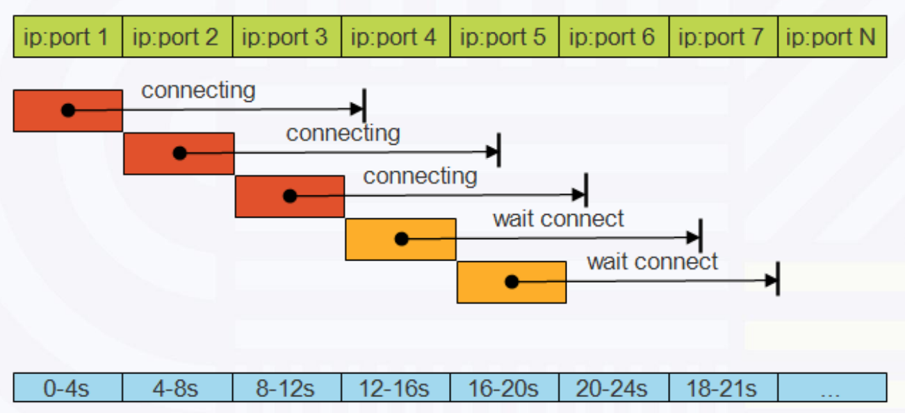

# 移动 APP 网络优化概述

一般开发一个 APP，会直接调用系统提供的网络请求接口去服务端请求数据，再针对返回的数据进行一些处理，或者使用AFNetworking/OKHttp这样的网络库，管理好请求线程和队列，再自动做一些数据解析，就结束了。

但对于一些大型 APP，还会想针对网络的一些问题进行进一步优化，包括：

1. **速度** ：网络请求的速度怎样能进一步提升？
2. **弱网** ：移动端网络环境随时变化，经常出现网络连接很不稳定可用性差的情况，怎样在这种情况下最大限度最快地成功请求？
3. **安全** ：怎样防止被第三方窃听/篡改或冒充，防止运营商劫持，同时又不影响性能？

对基于浏览器的前端开发来说，网络这块能做的事情很少，但对于客户端 APP 来说，整个网络请求过程是自由控制的，可以做很多事情，很多大型 APP 都针对这三个问题做了很多网络层的优化，一些新的网络层协议像 HTTP2 / QUIC 也是在这些方面进行了不少优化，在这里边学习边整理，大致列举一下常见的做法。

## 速度

正常一条网络请求需要经过的流程是这样：

1. DNS 解析，请求DNS服务器，获取域名对应的 IP 地址。
2. 与服务端建立连接，包括 tcp 三次握手，安全协议同步流程。
3. 连接建立完成，发送和接收数据，解码数据。

这里有明显的三个优化点：

1. 直接使用 IP 地址，去除 DNS 解析步骤。
2. 不要每次请求都重新建立连接，复用连接或一直使用同一条连接(长连接)。
3. 压缩数据，减小传输的数据大小。

逐条来看能做什么。

### 1.DNS

DNS 完整的解析流程很长，会先从本地系统缓存取，若没有就到最近的 DNS 服务器取，若没有再到主域名服务器取，每一层都有缓存，但为了域名解析的实时性，每一层缓存都有过期时间，这种 DNS 解析机制有几个缺点：

1. 缓存时间设置得长，域名更新不及时，设置得短，大量 DNS 解析请求影响请求速度。
2. 域名劫持，容易被中间人攻击，或被运营商劫持，把域名解析到第三方 IP 地址，据统计劫持率会达到7%。
3. DNS 解析过程不受控制，无法保证解析到最快的IP
4. 一次请求只能解析一个域名。

为了解决这些问题，就有了 HTTPDNS，原理很简单，就是自己做域名解析的工作，通过 HTTP 请求后台去拿到域名对应的 IP 地址，直接解决上述所有问题：

1. 域名解析与请求分离，所有请求都直接用IP地址，无需 DNS 解析，APP 定时请求 HTTPDNS 服务器更新IP地址即可。
2. 通过签名等方式，保证 HTTPDNS 请求的安全，避免被劫持。
3. DNS 解析由自己控制，可以确保根据用户所在地返回就近的 IP 地址，或根据客户端测速结果使用速度最快的 IP。
4. 一次请求可以解析多个域名。

其余细节就不多说了，HTTPDNS 优点这么多，几乎成为中大型 APP 的标配。至此解决了第一个问题 — DNS 解析耗时的问题，顺便把一部分安全问题 — DNS 劫持也解决了。

### 2.连接

第二个问题，连接建立耗时的问题，这里主要的优化思路是复用连接，不用每次请求都重新建立连接，如何更有效率地复用连接，可以说是网络请求速度优化里最主要的点了，并且这里的优化仍在演进过程中，值得了解下。

#### keep-alive

HTTP 协议里有个 keep-alive，HTTP1.1默认开启，一定程度上缓解了每次请求都要进行TCP三次握手建立连接的耗时。原理是请求完成后不立即释放连接，而是放入连接池中，若这时有另一个请求要发出，请求的域名和端口是一样的，就直接拿出连接池中的连接进行发送和接收数据，少了建立连接的耗时。

实际上现在无论是客户端还是浏览器都默认开启了keep-alive，对同个域名不会再有每发一个请求就进行一次建连的情况，纯短连接已经不存在了。但有个问题，就是这个 keep-alive 的连接一次只能发送接收一个请求，在上一个请求处理完成之前，无法接受新的请求。若同时发起多个请求，就有两种情况：

1. 若串行发送请求，可以一直复用一个连接，但速度很慢，每个请求都要等待上个请求完成再进行发送。
2. 若并行发送这些请求，那么首次每个请求都要进行tcp三次握手建立新的连接，虽然第二次可以复用连接池里这堆连接，但若连接池里保持的连接过多，对服务端资源产生较大浪费，若限制了保持的连接数，并行请求里超出的连接仍每次要建连。

对这个问题，新一代协议 HTTP2 提出了多路复用去解决。

#### 多路复用

HTTP2 的多路复用机制一样是复用连接，但它复用的这条连接支持同时处理多条请求，所有请求都可以并发在这条连接上进行，也就解决了上面说的并发请求需要建立多条连接带来的问题，网络上有张图可以较形象地表现这个过程：

 

 

HTTP1.1的协议里，在一个连接里传送数据都是串行顺序传送的，必须等上一个请求全部处理完后，下一个请求才能进行处理，导致这些请求期间这条连接并不是满带宽传输的，即使是HTTP1.1的pipelining可以同时发送多个request，但response仍是按请求的顺序串行返回，只要其中一个请求的response稍微大一点或发生错误，就会阻塞住后面的请求。

HTTP2 这里的多路复用协议解决了这些问题，它把在连接里传输的数据都封装成一个个stream，每个stream都有标识，stream的发送和接收可以是乱序的，不依赖顺序，也就不会有阻塞的问题，接收端可以根据stream的标识去区分属于哪个请求，再进行数据拼接，得到最终数据。

解释下多路复用这个词，多路可以认为是多个连接，多个操作，复用就是字面上的意思，复用一条连接或一个线程。HTTP2这里是连接的多路复用，网络相关的还有一个I/O的多路复用(select/epoll)，指通过事件驱动的方式让多个网络请求返回的数据在同一条线程里完成读写。

客户端来说，iOS9 以上 NSURLSession 原生支持 HTTP2，只要服务端也支持就可以直接使用，Android 的 okhttp3 以上也支持了 HTTP2，国内一些大型 APP 会自建网络层，支持 HTTP2 的多路复用，避免系统的限制以及根据自身业务需要增加一些特性，例如微信的开源网络库 [mars](https://github.com/Tencent/mars/wiki) ，做到一条长连接处理微信上的大部分请求，多路复用的特性上基本跟 HTTP2 一致。

#### TCP队头阻塞

HTTP2 的多路复用看起来是完美的解决方案，但还有个问题，就是队头阻塞，这是受限于 TCP 协议，TCP 协议为了保证数据的可靠性，若传输过程中一个 TCP 包丢失，会等待这个包重传后，才会处理后续的包。HTTP2的多路复用让所有请求都在同一条连接进行，中间有一个包丢失，就会阻塞等待重传，所有请求也就被阻塞了。

对于这个问题不改变 TCP 协议就无法优化，但 TCP 协议依赖操作系统实现以及部分硬件的定制，改进缓慢，于是 GOOGLE 提出 QUIC 协议，相当于在 UDP 协议之上再定义一套可靠传输协议，解决 TCP 的一些缺陷，包括队头阻塞。具体解决原理网上资料较多，可以看看。

QUIC 处于起步阶段，少有客户端接入，QUIC 协议相对于 HTTP2 最大的优势是对TCP队头阻塞的解决，其他的像安全握手 0RTT / 证书压缩等优化 TLS1.3 已跟进，可以用于 HTTP2，并不是独有特性。TCP 队头阻塞在 HTTP2 上对性能的影响有多大，在速度上 QUIC 能带来多大提升待研究。

### 3.数据

第三个问题，传输数据大小的问题。数据对请求速度的影响分两方面，一是压缩率，二是解压序列化反序列化的速度。目前最流行的两种数据格式是 json 和 protobuf，json 是字符串，protobuf 是二进制，即使用各种压缩算法压缩后，protobuf 仍会比 json 小，数据量上 protobuf 有优势，序列化速度 protobuf 也有一些优势，这两者的对比就不细说了。

压缩算法多种多样，也在不断演进，最新出的 Brotli 和Z-standard实现了更高的压缩率， [Z-standard](https://github.com/facebook/zstd) 可以根据业务数据样本训练出适合的字典，进一步提高压缩率，目前压缩率表现最好的算法。

除了传输的 body 数据，每个请求 HTTP 协议头的数据也是不可忽视，HTTP2 里对 HTTP 协议头也进行了压缩，HTTP 头大多是重复数据，固定的字段如 method 可以用静态字典，不固定但多个请求重复的字段例如 cookie 用动态字典，可以达到非常高的压缩率， [这里](https://imququ.com/post/header-compression-in-http2.html) 有详细介绍。

通过 HTTPDNS，连接多路复用，更好的数据压缩算法，可以把网络请求的速度优化到较不错的程度了，接下来再看看弱网和安全上可以做的事情。

## 弱网

手机无线网络环境不稳定，针对弱网的优化，微信有较多实践和分享，包括：

1. 提升连接成功率 

复合连接，建立连接时，阶梯式并发连接，其中一条连通后其他连接都关闭。这个方案结合串行和并发的优势，提高弱网下的连接成功率，同时又不会增加服务器资源消耗：


2. 制定最合适的超时时间

对总读写超时(从请求到响应的超时)、首包超时、包包超时(两个数据段之间的超时)时间制定不同的计算方案，加快对超时的判断，减少等待时间，尽早重试。这里的超时时间还可以根据网络状态动态设定。

3. 调优TCP参数，使用TCP优化算法。

对服务端的TCP协议参数进行调优，以及开启各种优化算法，使得适合业务特性和移动端网络环境，包括RTO初始值，混合慢启动，TLP，F-RTO等。

针对弱网的这些细致优化未成为标准，系统网络库没有内置，不过前两个客户端优化微信的开源网络库 mars 有实现，若有需要可以使用。

## 安全

标准协议 TLS 保证了网络传输的安全，前身是 SSL，不断在演进，目前最新是 TLS1.3。常见的 HTTPS 就是 HTTP 协议加上 TLS 安全协议。

安全协议概括性地说解决两个问题：1.保证安全 2. 降低加密成本

在保证安全上：

1. 使用加密算法组合对传输数据加密，避免被窃听和篡改。
2. 认证对方身份，避免被第三方冒充。
3. 加密算法保持灵活可更新，防止定死算法被破解后无法更换，禁用已被破解的算法。

降低加密成本上：

1. 用对称加密算法加密传输数据，解决非对称加密算法的性能低以及长度限制问题。
2. 缓存安全协议握手后的密钥等数据，加快第二次建连的速度。
3. 加快握手过程：2RTT-> 0RTT。加快握手的思路，就是原本客户端和服务端需要协商使用什么算法后才能加密发送数据，变成通过内置的公钥和默认的算法，在握手的同时就把数据发出去，也就是不需要等待握手就开始发送数据，达到0RTT。

这些点涉及的细节非常多，对 TLS 的介绍有 [一篇雄文](https://blog.helong.info/blog/2015/09/07/tls-protocol-analysis-and-crypto-protocol-design/) ，说得很详细，在此推荐。

目前基本主流都支持 TLS1.2，iOS 网络库默认使用 TLS1.2，Android4.4 以上支持 1.2。TLS1.3 iOS 还处于测试阶段，Android 未查到消息。对于普通 APP，只要正确配置证书，TLS1.2 已经能保证传输安全，只是在建连速度上会有所损耗，有一些大型 APP 像微信就 [自行实现](http://blog.cnbang.net/tech/3531/%28https://github.com/WeMobileDev/article/blob/master/%E5%9F%BA%E4%BA%8ETLS1.3%E7%9A%84%E5%BE%AE%E4%BF%A1%E5%AE%89%E5%85%A8%E9%80%9A%E4%BF%A1%E5%8D%8F%E8%AE%AEmmtls%E4%BB%8B%E7%BB%8D.md%29) 了 TLS1.3 的部分协议，早一步全平台支持。

## 最后

网络优化这个话题非常庞大，本文只是在学习过程中从优化思路上列举了目前业界常见的优化点，还有很多细节很多更深入的优化没涉及到，网络层实践开发经验不足，若有错误欢迎指出。

[移动 APP 网络优化概述 2018-1-9](http://blog.cnbang.net/tech/3531/)